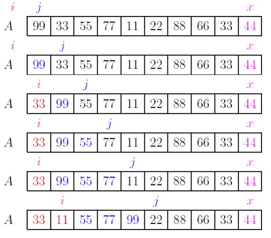
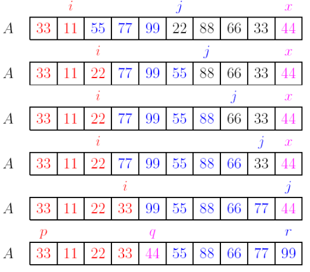
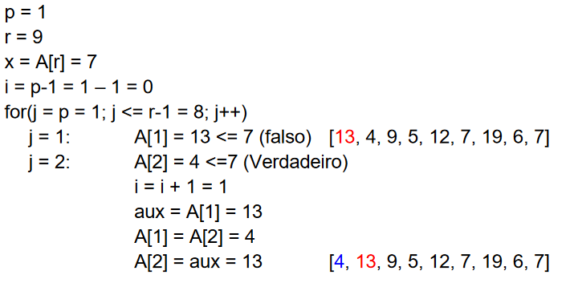
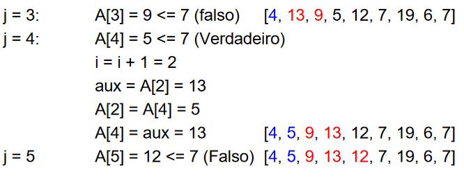
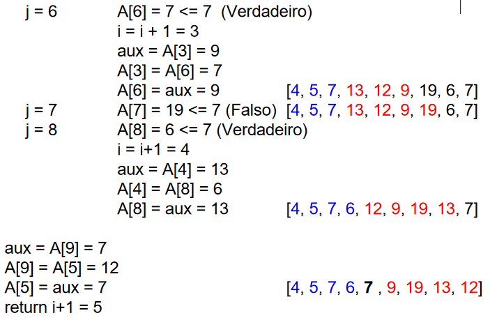

# RECURSÃO

## Exemplo - Fatorial
<br/>
Fatorial de um número se dá por:

```
Fatorial(n) = 
    • 1, se n <= 1
    • n * Fatorial(n - 1), se n > 1
```

### Em C

Cálculo padrão do fatorial de um número
```c
int fatorial (int n)
{
    int i, f=1;
    for (i = 2; i <= n; i++)
    {
        f *= i;
    }
    return f;
}
```
<br/>

Toda recursão tem um critério de parada  
Cálculo de fatorial com recursividade

```c
int fatorial_rec (int n)
{
    if (n <= 1) return 1;
    return n * fatorial_rec(n-1);
}
```

<strong>Pilha recursiva - para cada entrada 1 chamada</strong>

## Exemplo - Fibonacci
Fibonacci em um número se dá por:
```
Fibonacci(n) = 
    • 1, se n <= 1
    • Fibonacci(n - 1) + Fibonacci(n-2)
```

### Em C
Com recursão
```c
int fibonacci (int n)
{
    if (n <= 1) return 1;
    return fibonacci(n-1) + fibonacci(n-2);
}
```

<strong>Árvore recursiva - para cada entrada 2 chamadas</strong>

## Divisão e Conquista
Quando tem um problema de entrada grande, divide em partes menores e resolve cada pedaço separadamente, recursivamente, então combina os resultados das pequenas partes de volta ao inteiro  
<br>  
Quicksort segue o paradigma de divisão e conquista  
Divide o vetor em dois subvetores, tais que:  

| p | q | r |   
| --- | --- | --- |
| <=x | x | >= x|  

Então ordena os subvetores da mesma forma recursivamente e combina de volta as partições
<br>  
“dado um vetor A[p..r], rearranjar A[p..r]
de modo que todos os elementos pequenos fiquem
na parte esquerda do vetor e todos os elementos
grandes fiquem na parte direita.”  
Escolhe-se um pivô X, o que for maior que X é considerado grande e o que for menor pequeno
<br>

<br>
<br>
<br>
Por etapas:
<br>

<br>


### Algoritmo partition
```java
public int partition(double[] A, int p, int r) {
    double x = A[r]; // O pivô é o último elemento do vetor 
    int i = p-1;
    for(int j = p; j < r; j++){
        if (A[j] <= x) {
            i = i + 1;
            double aux = A[i];
            A[i] = A[j];
            A[j] = aux;
        }
    }
    i = i + 1;
    A[r] = A[i];
    A[i] = x;
    return i;
}
```
<br>

<strong>Funcionamento partition </strong>
<br>

<br>

<br>
